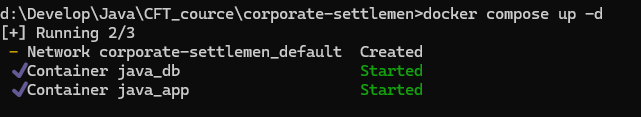
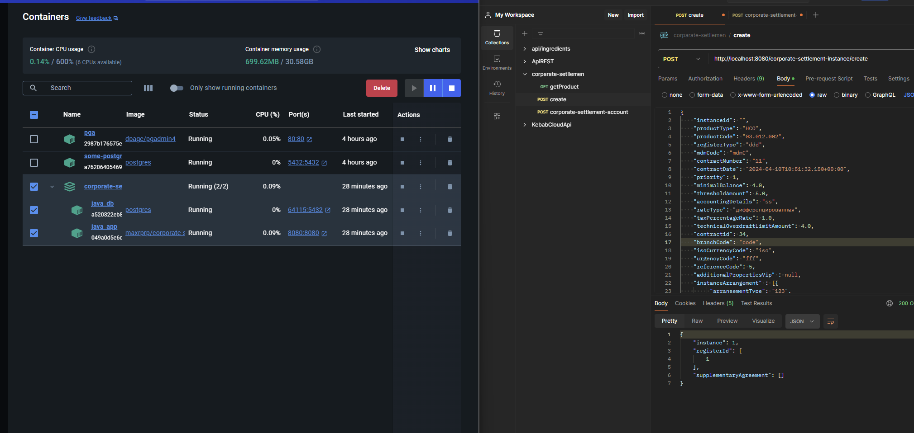
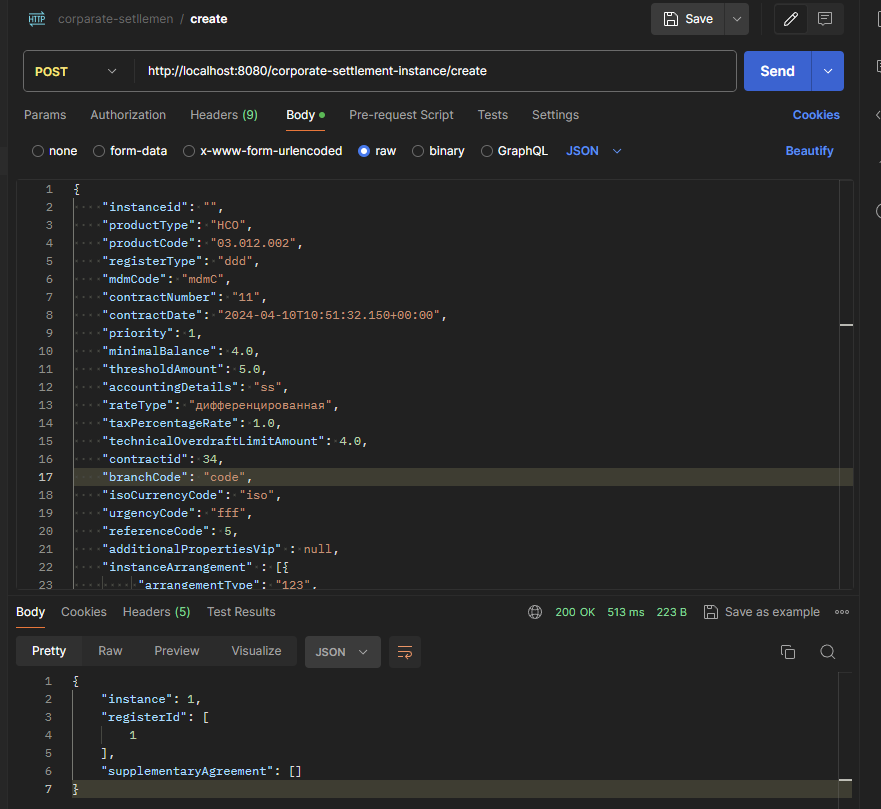
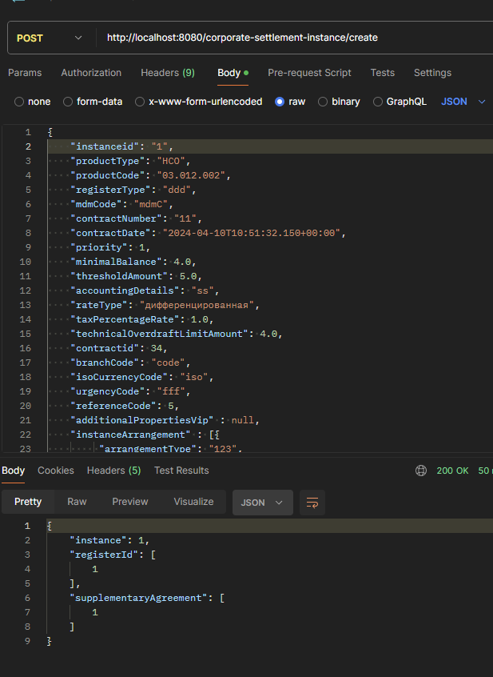
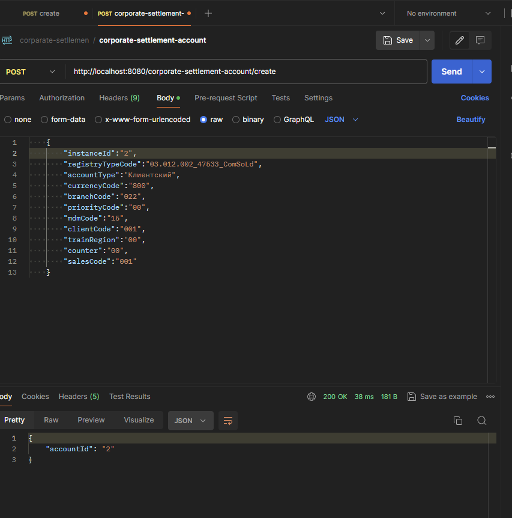

<h1>Инструкция</h1>
<h3>Запуск</h3>

Для запуска нужно ввести команду <strong>docker compose up -d</strong>  из корня проекта

<h3>Пример работы</h3>

<h4>http://localhost:8080/corporate-settlement-instance/create</h4>

<h4>http://localhost:8080/corporate-settlement-account/create</h4>

<h3>Запросы</h3>
<h4>http://localhost:8080/corporate-settlement-instance/create</h4>
<code>
{
    "instanceid": "1",
    "productType": "НСО",
    "productCode": "03.012.002",
    "registerType": "ddd",
    "mdmCode": "mdmC",
    "contractNumber": "11",
    "contractDate": "2024-04-10T10:51:32.150+00:00",
    "priority": 1,
    "minimalBalance": 4.0,
    "thresholdAmount": 5.0,
    "accountingDetails": "ss",
    "rateType": "дифференцированная",
    "taxPercentageRate": 1.0,
    "technicalOverdraftLimitAmount": 4.0,
    "contractid": 34,
    "branchCode": "code",
    "isoCurrencyCode": "iso",
    "urgencyCode": "fff",
    "referenceCode": 5,
    "additionalPropertiesVip" : null,
    "instanceArrangement" : [{
         "arrangementType": "123",
            "shedulerJobId": 1,
            "openingDate": "2024-04-10T10:51:32.153+00:00",
            "closingDate": "2024-04-10T10:51:32.153+00:00",
            "cancelDate": "2024-04-10T10:51:32.153+00:00",
            "validityDuration": 1,
            "cancellationReason": "dd",
            "status": "dd",
            "interestCalculationDate": "2024-04-10T10:51:32.153+00:00",
            "interestRate": 1.0,
            "coefficient": 4.0,
            "coefficientAction": "123",
            "minimumInterestRate": 5.0,
            "minimumInterestRateCoefficient": "123",
            "minimumInterestRateCoefficientAction": "13",
            "maximalnterestRate": 123,
            "maximalnterestRateCoefficient": 33,
            "maximalnterestRateCoefficientAction": "123",
            "number": "13",
            "generalAgreementId": "h",
            "supplementaryAgreementId": "f"
    }]
}
</code>
<h4>http://localhost:8080/corporate-settlement-account/create</h4>
<code>
{
    "instanceId":"2",
    "registryTypeCode":"03.012.002_47533_ComSoLd",
    "accountType":"Клиентский",
    "currencyCode":"800",
    "branchCode":"022",
    "priorityCode":"00",
    "mdmCode":"15",
    "clientCode":"001",
    "trainRegion":"00",
    "counter":"00",
    "salesCode":"001"
}
    </code>